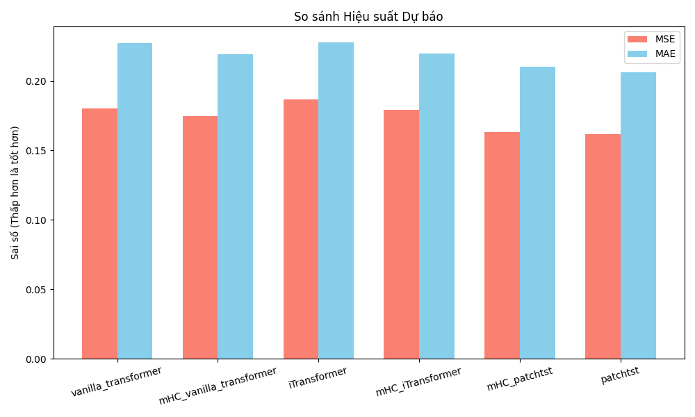
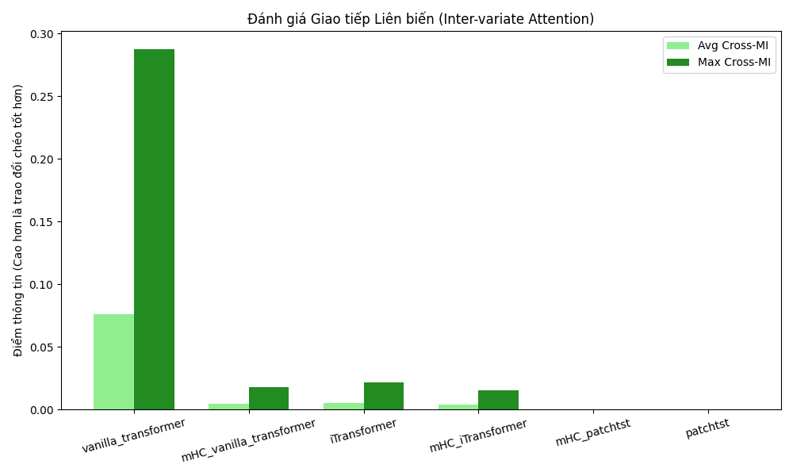

## mHC-Time-Series (Manifold-Constrained Hyper-Connections)

Research implementation of **mHC** (DeepSeek; https://arxiv.org/abs/2512.24880) as a drop-in variant of **Hyper-Connections** (https://arxiv.org/abs/2409.19606) specifically tailored for **Time-Series Forecasting** Transformers.

### What we're building

A runnable PyTorch implementation replacing standard Transformer residual streams with the mHC layer update:

$$x_{l+1} = H_l^{res} x_l + H_l^{post,T} F(H_l^{pre} x_l, W_l)$$

with the key constraints:

- $H^{res}$: **doubly stochastic** (Birkhoff polytope; entries ≥ 0, rows sum to 1, cols sum to 1), solved via **Sinkhorn-Knopp**.
- $H^{pre}$, $H^{post}$: **non-negative** mixing maps (via softmax).

By forcing the residual paths to respect these manifold constraints, the models can learn complex, long-term inter-variate dependencies without signal degradation or representation collapse.

### Implementation direction

Supported baseline architectures and their mHC-enhanced counterparts:

- `vanilla_transformer` / `mHC_vanilla_transformer`
- `iTransformer` / `mHC_iTransformer` (Inverted architecture, highly optimized for mHC)
- `patchtst` / `mHC_patchtst`

This is a research prototype aimed at validating the impact of mHC on **Information Flow** (Self-MI & Cross-MI) and **Gradient Stability** over temporal sequences.

### Running (Time Series on Weather Dataset)

Run from the project root. The `main.py` script acts as an automated pipeline to benchmark models sequentially.

**Run a complete benchmark (All Models):**

```bash
python main.py \
    --data_path dataset/weather/weather.csv \
    --task_name long_term_forecast \
    --enc_in 21 --dec_in 21 --c_out 21 \
    --seq_len 96 --label_len 48 --pred_len 96 \
    --e_layers 3 --d_model 512 \
    --batch_size 32 --epochs 10 --patience 3
```

### Automated Artifacts & Checkpointing

The pipeline automatically handles parameter tracking and evaluation metrics. All outputs are generated and stored in the `./eval_results/` directory, which includes:

- **`saved_weights/`**: Stores independent `.pth` checkpoint files for each converged model.
- **`summary_log.txt`**: Contains raw logs tracking Trainable Parameters, MSE, MAE, Self-MI, and Avg-Cross-MI.
- **`compare_forecasting.png`**: Provides bar charts to compare predictive accuracy.
  
- **`compare_mutual_information.png`**: Visually evaluates inter-variate communication.
  

### Information Flow Analysis

This pipeline utilizes a perturbation-based sensitivity analysis via `calculate_perturbation_mi`. This method measures the amount of information variates share across the manifold in comparison to standard identity mappings.

### Acknowledgements

- Core hyper-connection routing logic is adapted from [lucidrains/hyper-connections](https://github.com/lucidrains/hyper-connections).
- Time-series layers and data providers are built upon the foundations of the [Time-Series-Library](https://github.com/thuml/Time-Series-Library).
- The conceptual foundation is based on DeepSeek's [mHC paper](https://arxiv.org/abs/2512.24880).
